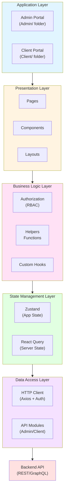
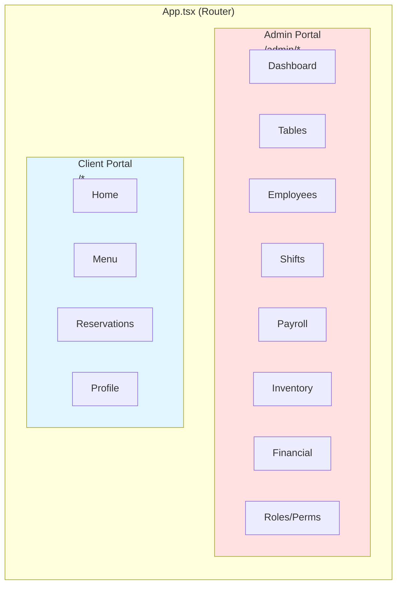
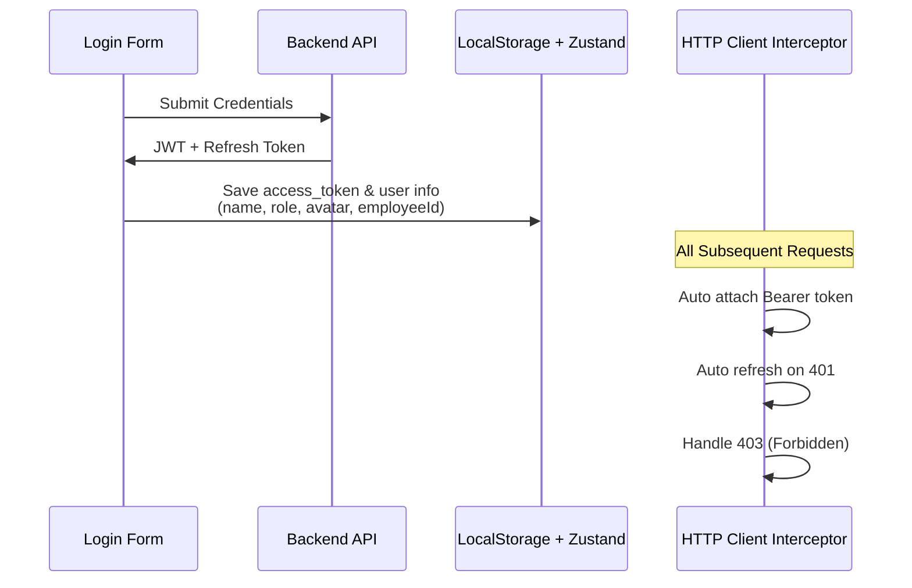
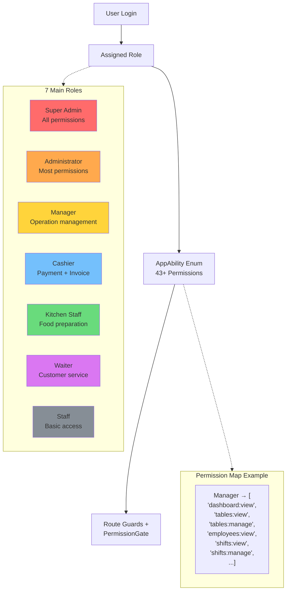
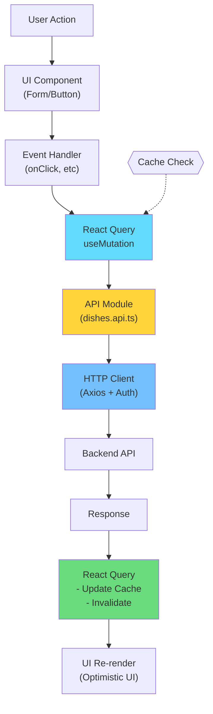

# 🏗️ Kiến Trúc Tổng Quan Hệ Thống

## 📋 Mục Lục
- [Giới Thiệu](#giới-thiệu)
- [Tech Stack](#tech-stack)
- [Kiến Trúc Tổng Quan](#kiến-trúc-tổng-quan)
- [Cấu Trúc Thư Mục](#cấu-trúc-thư-mục)
- [Mô Hình Kiến Trúc](#mô-hình-kiến-trúc)

---

## Giới Thiệu

**Restaurant Management System** là một ứng dụng web quản lý nhà hàng toàn diện được xây dựng bằng **React + TypeScript + Vite**. Hệ thống hỗ trợ hai vai trò chính:

- 🔐 **Admin Portal**: Quản lý toàn bộ hoạt động nhà hàng
- 🍽️ **Client Portal**: Giao diện cho khách hàng đặt bàn, xem menu, đặt món

---

## Tech Stack

### Core Framework
```
React 18.3.1          → UI Framework
TypeScript 5.6.2      → Type Safety
Vite 6.0.5           → Build Tool & Dev Server
```

### State Management
```
Zustand 5.0.8                    → Global State Management
@tanstack/react-query 5.64.1    → Server State & Caching
React Hook Form 7.54.2           → Form State Management
```

### Routing & Navigation
```
React Router DOM 7.1.1  → Client-side Routing
```

### UI & Styling
```
TailwindCSS 3.4.17              → Utility-first CSS
Radix UI                        → Headless UI Components
Lucide React                    → Icon Library
Framer Motion 11.18.1           → Animations
Ant Design 5.26.3               → Complex UI Components
```

### Data Fetching & API
```
Axios 1.7.9        → HTTP Client
Socket.io-client   → Real-time Communication (planned)
```

### Form & Validation
```
React Hook Form 7.54.2       → Form Management
Yup 1.6.1                    → Schema Validation
@hookform/resolvers 3.10.0   → RHF + Yup Integration
```

### Charts & Visualization
```
Chart.js 4.5.0              → Chart Library
React-Chartjs-2 5.3.0       → React Wrapper for Chart.js
FullCalendar 6.1.15         → Calendar & Scheduling
```

### Utilities
```
date-fns 4.1.0           → Date Manipulation
dayjs 1.11.18            → Lightweight Date Library
lodash 4.17.21           → Utility Functions
clsx / classnames        → Conditional CSS Classes
js-cookie 3.0.5          → Cookie Management
```

### Development Tools
```
ESLint 8.57.0         → Code Linting
Prettier 3.4.2        → Code Formatting
TypeScript ESLint     → TypeScript Linting
```

---

## Kiến Trúc Tổng Quan

Hệ thống sử dụng kiến trúc **Feature-Based Modular Architecture** kết hợp với **Layered Architecture**:



---

## Cấu Trúc Thư Mục

```
src/
├── Admin/                      # 🔐 Admin Portal Module
│   ├── Components/            # Admin-specific components
│   │   ├── HeaderAdmin/
│   │   ├── Sidebar/
│   │   ├── PermissionMatrix/
│   │   └── ...
│   ├── Layouts/              # Admin layout wrappers
│   │   ├── MainLayoutAdmin/
│   │   └── LayoutAuthAdmin/
│   ├── Pages/                # Admin feature pages
│   │   ├── ManageDashboard/
│   │   ├── ManageTable/
│   │   ├── ManageDished/
│   │   ├── ManageEmployee/
│   │   ├── ManageShift/
│   │   ├── ManagePayroll/
│   │   ├── ManageIngredient/
│   │   ├── ManageStockImport/
│   │   ├── ManageFinancial/
│   │   ├── ManageRoles/
│   │   └── ...
│   └── Routes/               # Admin routing configuration
│       └── useRouterAdmin.tsx
│
├── Client/                    # 🍽️ Client Portal Module
│   ├── Components/           # Client-specific components
│   ├── Layout/              # Client layouts
│   ├── Pages/               # Client pages
│   │   ├── Home/
│   │   ├── Menu/
│   │   ├── Table/
│   │   ├── Login/
│   │   └── ...
│   └── Routes/              # Client routing
│       └── useRouterClient.tsx
│
├── Apis/                      # 📡 API Layer
│   ├── Admin/               # Admin API endpoints
│   │   ├── auth.api.ts
│   │   ├── dishes.api.ts
│   │   ├── employees.api.ts
│   │   ├── shifts.api.ts
│   │   ├── payroll.api.ts
│   │   ├── ingredients.api.ts
│   │   └── ...
│   ├── Client/              # Client API endpoints
│   └── admin.api.ts         # API aggregator
│
├── Authorization/             # 🔒 Authorization System (RBAC)
│   ├── abilities.ts         # Permission definitions
│   ├── roles.ts            # Role definitions
│   ├── permissionMap.ts    # Role-Permission mapping
│   ├── featurePermissions.ts
│   ├── PermissionBoundary.tsx
│   ├── PermissionGate.tsx
│   └── useAuthorization.ts
│
├── Components/               # 🧩 Shared Components
│   ├── ui/                 # Shadcn/Radix UI components
│   ├── Button/
│   ├── Input/
│   └── ...
│
├── StateGlobal/              # 🗄️ Global State
│   └── zustand.tsx         # Zustand store
│
├── Helpers/                  # 🛠️ Utility Functions
│   ├── http.ts            # HTTP client with interceptors
│   ├── auth.ts            # Auth utilities
│   ├── common.ts          # Common helpers
│   ├── role_permission.ts # Permission helpers
│   └── utils.ts
│
├── Hook/                     # 🎣 Custom Hooks
│   ├── useQueryParams.tsx
│   └── useRealtimeQuery.tsx
│
├── Types/                    # 📝 TypeScript Definitions
│   ├── user.type.ts
│   ├── employee.type.ts
│   ├── dish.type.ts
│   ├── shift.type.ts
│   ├── payroll.type.ts
│   ├── ingredient.type.ts
│   ├── invoice.type.ts
│   └── ...
│
├── Constants/               # 📌 Constants
│   ├── config.ts          # App configuration
│   ├── path.ts            # Route paths
│   ├── enum.ts            # Enums
│   └── httpStatus.ts      # HTTP status codes
│
├── Assets/                  # 🎨 Static Assets
│   ├── img/
│   └── figma/
│
├── lib/                     # 📚 Third-party Config
│   ├── utils.ts           # Tailwind utilities
│   └── chart.ts           # Chart.js config
│
├── App.tsx                  # 🚀 Root App Component
├── main.tsx                # 🎯 Application Entry Point
└── index.css               # 🎨 Global Styles
```

---

## Mô Hình Kiến Trúc

### 1. **Two-Portal Architecture**

Hệ thống được chia thành hai portal riêng biệt:



### 2. **Authentication Flow**



### 3. **RBAC (Role-Based Access Control)**



**Authorization Guards:**
- **Route Level**: `PermissionBoundary`
- **Component Level**: `PermissionGate`
- **Hook Level**: `useAuthorization`

### 4. **Data Flow Pattern**



---

## 🔗 Tài Liệu Liên Quan

- [Authentication & Authorization](./AUTHENTICATION_AUTHORIZATION.md)
- [Routing Structure](./ROUTING_STRUCTURE.md)
- [State Management](./STATE_MANAGEMENT.md)
- [API Architecture](./API_ARCHITECTURE.md)
- [Component Structure](./COMPONENT_STRUCTURE.md)
- [Data Flow](./DATA_FLOW.md)

---

**Cập nhật lần cuối**: October 21, 2025
