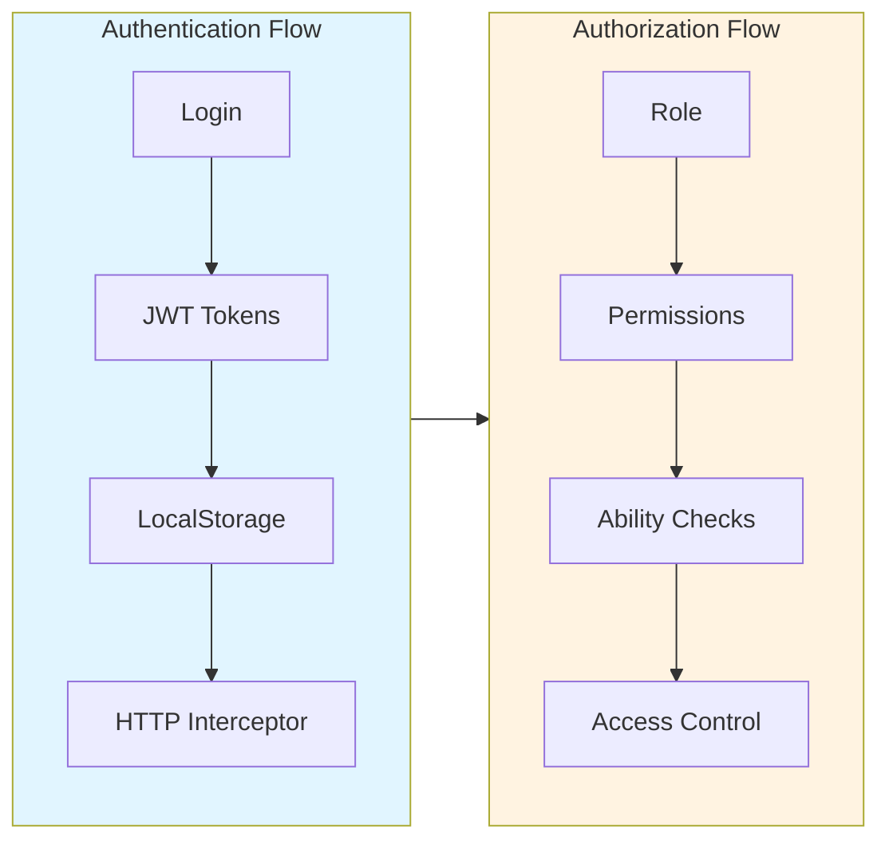
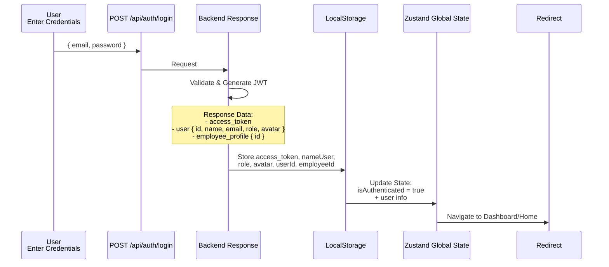
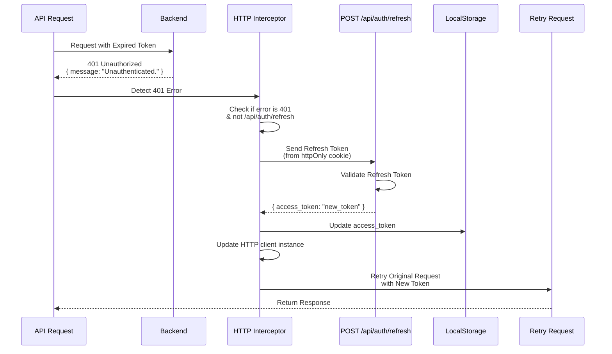
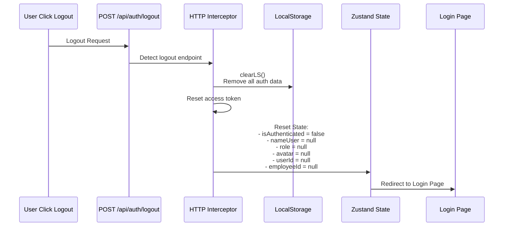

# 🔐 Authentication & Authorization

## 📋 Mục Lục
- [Tổng Quan](#tổng-quan)
- [Authentication System](#authentication-system)
- [Authorization System (RBAC)](#authorization-system-rbac)
- [Implementation Details](#implementation-details)
- [Security Features](#security-features)

---

## Tổng Quan

Hệ thống sử dụng **JWT-based Authentication** kết hợp với **Role-Based Access Control (RBAC)** để quản lý xác thực và phân quyền.



---

## Authentication System

### 1. **Login Flow**



### 2. **Token Management**

#### Access Token
- Lưu trong `localStorage` với key: `access_token`
- Tự động đính kèm vào mọi request qua HTTP Interceptor
- Format: `Bearer {token}`

#### Token Refresh Flow



### 3. **Logout Flow**



---

## Authorization System (RBAC)

### 1. **Roles Hierarchy**

```mermaid
graph TB
    subgraph SuperAdmin["Super Administrator"]
        SA["All Permissions<br/>+ Permission Matrix Management"]
    end
    
    subgraph Admin["Administrator"]
        ADM["All Permissions<br/>Except Permission Matrix Management"]
    end
    
    subgraph Manager["Manager"]
        MNG["• Dashboard, Tables, Reservations<br/>• Customers, Employees<br/>• Shifts, Payroll<br/>• Menu, Dishes<br/>• Ingredients, Suppliers<br/>• Warehouse (Import/Export/Loss)<br/>• Invoices, Promotions"]
    end
    
    subgraph Cashier["Cashier"]
        CSH["• Dashboard (View)<br/>• Customers (View/Manage)<br/>• Reservations (View)<br/>• Invoices (View/Manage)<br/>• Promotions (View/Manage)"]
    end
    
    subgraph Kitchen["Kitchen Staff"]
        KIT["• Menu Categories (View/Manage)<br/>• Dishes (View/Manage)<br/>• Menu (View/Manage)<br/>• Ingredients (View/Manage)<br/>• Suppliers (View)<br/>• Warehouse (Import/Export/Loss)"]
    end
    
    subgraph Waiter["Waiter"]
        WAT["• Tables (View/Manage)<br/>• Reservations (View/Manage)<br/>• Customers (View)<br/>• Menu, Dishes (View only)"]
    end
    
    subgraph Staff["Staff"]
        STF["Basic View Permissions"]
    end
    
    style SuperAdmin fill:#ff6b6b
    style Admin fill:#ffa94d
    style Manager fill:#ffd43b
    style Cashier fill:#74c0fc
    style Kitchen fill:#69db7c
    style Waiter fill:#da77f2
    style Staff fill:#868e96
```



### 2. **Permission Structure**

Permissions theo format: `{resource}:{action}`

```typescript
// Ví dụ Permissions
enum AppAbility {
  DASHBOARD_VIEW = "dashboard:view",
  
  TABLES_VIEW = "tables:view",
  TABLES_MANAGE = "tables:manage",
  
  EMPLOYEES_VIEW = "employees:view",
  EMPLOYEES_MANAGE = "employees:manage",
  
  SHIFTS_VIEW = "shifts:view",
  SHIFTS_MANAGE = "shifts:manage",
  
  PAYROLL_VIEW = "payroll:view",
  PAYROLL_MANAGE = "payroll:manage",
  
  DISH_VIEW = "dishes:view",
  DISH_MANAGE = "dishes:manage",
  
  INGREDIENTS_VIEW = "ingredients:view",
  INGREDIENTS_MANAGE = "ingredients:manage",
  
  INVOICES_VIEW = "invoices:view",
  INVOICES_MANAGE = "invoices:manage",
  
  // ... và nhiều hơn nữa
}
```

### 3. **Role-Permission Mapping**

```typescript
// src/Authorization/permissionMap.ts
const ROLE_PERMISSIONS: Record<AppRole, AppAbility[]> = {
  [AppRole.SUPER_ADMIN]: ALL_ABILITIES,
  
  [AppRole.ADMINISTRATOR]: [
    // All abilities except PERMISSION_MATRIX_MANAGE
  ],
  
  [AppRole.MANAGER]: [
    AppAbility.DASHBOARD_VIEW,
    AppAbility.TABLES_VIEW,
    AppAbility.TABLES_MANAGE,
    AppAbility.EMPLOYEES_VIEW,
    AppAbility.EMPLOYEES_MANAGE,
    // ... many more
  ],
  
  [AppRole.CASHIER]: [
    AppAbility.DASHBOARD_VIEW,
    AppAbility.CUSTOMERS_VIEW,
    AppAbility.CUSTOMERS_MANAGE,
    AppAbility.INVOICES_VIEW,
    AppAbility.INVOICES_MANAGE,
    // ...
  ],
  
  // ... other roles
}
```

---

## Implementation Details

### 1. **Route Protection**

#### Admin Routes
```tsx
// src/Admin/Routes/useRouterAdmin.tsx

// Protected Route - Yêu cầu đăng nhập
const ProtectedRoute = () => {
  const { isAuthenticated } = useAppStore()
  return isAuthenticated ? <Outlet /> : <Navigate to={path.AdminLogin} />
}

// Permission Boundary - Kiểm tra quyền truy cập
const FEATURE_ROUTES = [
  { 
    path: path.AdminDashboard, 
    feature: "dashboard", 
    Component: ManageDashboard 
  },
  { 
    path: path.AdminEmployees, 
    feature: "staff", 
    Component: ManageEmployee 
  },
  // ...
]

// Wrap component với Permission Check
const withPermission = (feature: FeatureKey, Component) => (
  <Suspense>
    <PermissionBoundary ability={FEATURE_VIEW_ABILITY[feature]}>
      <Component />
    </PermissionBoundary>
  </Suspense>
)
```

#### Client Routes
```tsx
// src/Client/Routes/useRouterClient.tsx

// Block Admin access to Client Portal
const BlockAdminForClient = () => {
  const { role } = useAppStore()
  if (role && resolveRole(role)) {
    return <Navigate to={path.AdminNotFound} replace />
  }
  return <Outlet />
}
```

### 2. **Component-Level Authorization**

#### Using PermissionGate
```tsx
import { PermissionGate, AppAbility } from 'src/Authorization'

function EmployeeManagement() {
  return (
    <div>
      <h1>Quản lý Nhân viên</h1>
      
      {/* Chỉ hiển thị nút nếu có quyền manage */}
      <PermissionGate ability={AppAbility.EMPLOYEES_MANAGE}>
        <button>Thêm nhân viên mới</button>
        <button>Chỉnh sửa</button>
        <button>Xóa</button>
      </PermissionGate>
      
      {/* Ai cũng xem được (có quyền view) */}
      <EmployeeList />
    </div>
  )
}
```

#### Using useAuthorization Hook
```tsx
import { useAuthorization, AppAbility } from 'src/Authorization'

function PayrollPage() {
  const { can, role, roleLabel } = useAuthorization()
  
  const canManagePayroll = can(AppAbility.PAYROLL_MANAGE)
  const canViewPayroll = can(AppAbility.PAYROLL_VIEW)
  
  if (!canViewPayroll) {
    return <NoAccessPage />
  }
  
  return (
    <div>
      <h1>Bảng lương - {roleLabel}</h1>
      
      {canManagePayroll && (
        <div>
          <button>Tạo bảng lương mới</button>
          <button>Chỉnh sửa</button>
        </div>
      )}
      
      <PayrollList />
    </div>
  )
}
```

#### Multiple Permissions Check
```tsx
const { can, canSome, hasRole, hasAnyRole } = useAuthorization()

// Phải có TẤT CẢ các quyền
const canFullAccess = can([
  AppAbility.INVOICES_VIEW,
  AppAbility.INVOICES_MANAGE,
  AppAbility.PROMOTIONS_MANAGE
])

// Chỉ cần CÓ MỘT trong các quyền
const canPartialAccess = canSome([
  AppAbility.INVOICES_VIEW,
  AppAbility.PROMOTIONS_VIEW
])

// Kiểm tra role cụ thể
const isManager = hasRole(AppRole.MANAGER)

// Kiểm tra một trong các role
const isAdminOrManager = hasAnyRole([
  AppRole.SUPER_ADMIN,
  AppRole.ADMINISTRATOR,
  AppRole.MANAGER
])
```

### 3. **PermissionBoundary Component**

Tự động chặn truy cập và hiển thị fallback UI:

```tsx
// src/Authorization/PermissionBoundary.tsx
export function PermissionBoundary({ 
  ability, 
  children, 
  fallback 
}: PermissionBoundaryProps) {
  const { can } = useAuthorization()
  
  if (!can(ability)) {
    if (fallback) {
      return <>{fallback}</>
    }
    return (
      <NoAccessPage 
        title="Không có quyền truy cập"
        message="Bạn không có quyền truy cập trang này"
      />
    )
  }
  
  return <>{children}</>
}
```

### 4. **API Request Authorization**

HTTP Client tự động đính kèm token:

```typescript
// src/Helpers/http.ts
this.instance.interceptors.request.use((cfg) => {
  const tokenLS = getAccessTokenFromLS()
  if (tokenLS && tokenLS !== this.accessToken) {
    this.accessToken = tokenLS
  }
  if (cfg.headers && this.accessToken) {
    cfg.headers.Authorization = `Bearer ${this.accessToken}`
  }
  return cfg
})
```

---

## Security Features

### 1. **Error Handling**

```typescript
// 401 Unauthorized - Token expired
if (isError401(error)) {
  // Auto refresh token
  this.refreshTokenRequest = this.handleRefreshToken()
  return this.refreshTokenRequest.then((newToken) => {
    // Retry request with new token
  })
}

// 403 Forbidden - No permission
if (isError403(error)) {
  toast.error("Không có quyền truy cập!")
}

// Refresh token expired
if (error.message === "Invalid or expired refresh token") {
  clearLS()
  toast.error("Phiên làm việc hết hạn")
  // Redirect to login
}
```

### 2. **Local Storage Event**

Đồng bộ logout trên nhiều tab:

```typescript
// src/Helpers/auth.ts
export const LocalStorageEventTarget = new EventTarget()

export const clearLS = () => {
  localStorage.removeItem('access_token')
  localStorage.removeItem('nameUser')
  // ... clear all auth data
  
  // Emit event to all tabs
  const clearEvent = new Event('ClearLS')
  LocalStorageEventTarget.dispatchEvent(clearEvent)
}

// src/App.tsx
useEffect(() => {
  LocalStorageEventTarget.addEventListener('ClearLS', reset)
  return () => {
    LocalStorageEventTarget.removeEventListener('ClearLS', reset)
  }
}, [reset])
```

### 3. **Role Normalization**

Hỗ trợ nhiều format role từ backend:

```typescript
// Input: "super_administrator" | "super admin" | "SUPER_ADMIN"
// Output: AppRole.SUPER_ADMIN

const resolveRole = (rawRole?: string | null): AppRole | null => {
  if (!rawRole) return null
  const normalized = rawRole.trim().toLowerCase()
  return ROLE_ALIAS_LOOKUP[normalized] ?? null
}
```

---

## 🔗 Best Practices

1. **Always check permissions at multiple levels**:
   - Route level (PermissionBoundary)
   - Component level (PermissionGate)
   - API level (Backend validation)

2. **Use appropriate authorization hooks**:
   - `can()` - Tất cả permissions phải có
   - `canSome()` - Một trong các permissions
   - `hasRole()` - Kiểm tra role cụ thể

3. **Handle unauthorized access gracefully**:
   - Hiển thị fallback UI
   - Redirect đến trang phù hợp
   - Show toast notification

4. **Never trust client-side authorization alone**:
   - Backend PHẢI validate permissions
   - Frontend chỉ để UX tốt hơn

---

**Cập nhật lần cuối**: October 21, 2025
